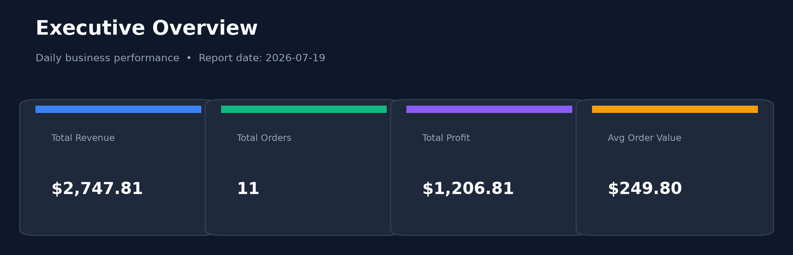
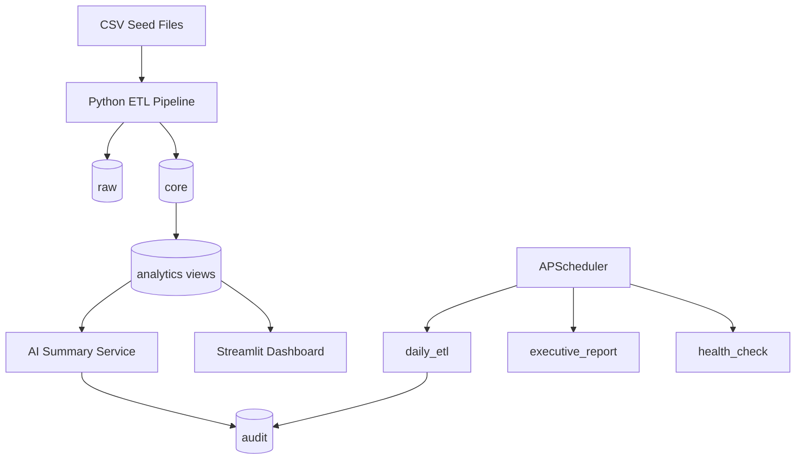

# Retail Analytics & BI Automation Platform

Automated retail business intelligence platform for daily KPI reporting, ETL pipelines, executive dashboards, and workflow monitoring.

<p align="center">
  
</p>

<p align="center">
  <strong>Python</strong> · <strong>PostgreSQL</strong> · <strong>Streamlit</strong> · <strong>APScheduler</strong> · <strong>Docker</strong>
</p>

---

## Business Problem

Retail executives need daily answers to:
- How much revenue and profit did we generate?
- How many orders came in?
- Which products are performing best?
- Are we running low on inventory?
- What should management do next?

This platform replaces manual reporting with an auditable automated pipeline.

## Key Features

- Modular Python ETL with validation and reject handling
- PostgreSQL layered schema with analytics views
- Scheduled jobs for ETL, reporting, and health checks
- AI executive summary service with safe KPI JSON input
- Interactive Streamlit dashboard with filters and CSV export
- Docker Compose deployment
- Unit, integration, and CI test coverage

## Architecture



See [docs/ARCHITECTURE.md](docs/ARCHITECTURE.md) and [docs/ER_DIAGRAM.md](docs/ER_DIAGRAM.md) for full diagrams.

## Tech Stack

| Layer | Technology |
|-------|------------|
| Language | Python 3.11+ |
| Database | PostgreSQL 16 |
| ORM / SQL | SQLAlchemy |
| Analytics | pandas + SQL views |
| Scheduling | APScheduler |
| AI | OpenAI API (optional) |
| Dashboard | Streamlit |
| Containers | Docker Compose |
| CI | GitHub Actions |

## Quick Start

### 1. Install dependencies

```powershell
git clone https://github.com/akshaya-polepalli/retail-analytics-bi-platform.git
cd retail-analytics-bi-platform
python -m venv venv
.\venv\Scripts\Activate.ps1
pip install -r requirements.txt
copy .env.example .env
```

### 2. Start PostgreSQL

```powershell
cd docker
docker compose up -d postgres
cd ..
```

PostgreSQL runs on **port 5433** by default.

### 3. Run the pipeline

```powershell
python -m src.run_pipeline
```

### 4. Launch the dashboard

```powershell
streamlit run dashboards/app.py --server.port 8502
```

Open http://localhost:8502

## Project Structure

```text
retail-analytics-bi-platform/
├── src/                 # Application code
├── dashboards/          # Streamlit UI
├── database/            # Schema and seed data
├── tests/               # Unit and integration tests
├── docs/                # Architecture and deployment guides
├── scripts/             # Utility scripts
└── docker/              # Docker Compose services
```

## KPI Definitions

| KPI | SQL Definition |
|-----|----------------|
| Revenue | `SUM(total_amount)` |
| Orders | `COUNT(DISTINCT order_id)` |
| Profit | `SUM(profit_amount)` |
| AOV | `Revenue / Orders` |

## Environment Variables

| Variable | Required | Description |
|----------|----------|-------------|
| `DATABASE_URL` | Yes | PostgreSQL connection string |
| `OPENAI_API_KEY` | No | Enables OpenAI summaries |
| `SLACK_WEBHOOK_URL` | No | Enables Slack alerts |

## Documentation

- [Architecture](docs/ARCHITECTURE.md)
- [ER Diagram](docs/ER_DIAGRAM.md)
- [Workflows](docs/WORKFLOWS.md)
- [Deployment](docs/DEPLOYMENT.md)
- [Demo Script](docs/DEMO_SCRIPT.md)
- [Changelog](CHANGELOG.md)

## License

MIT — see [LICENSE](LICENSE).
