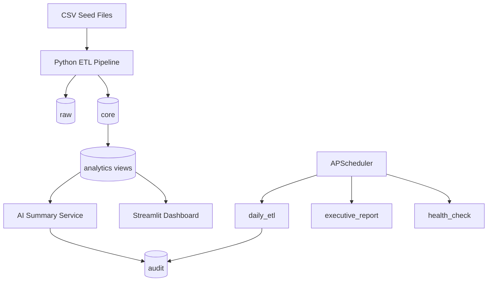
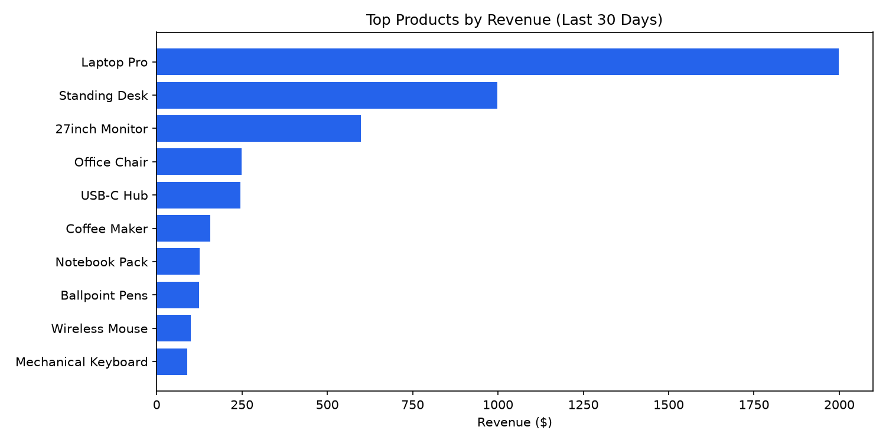
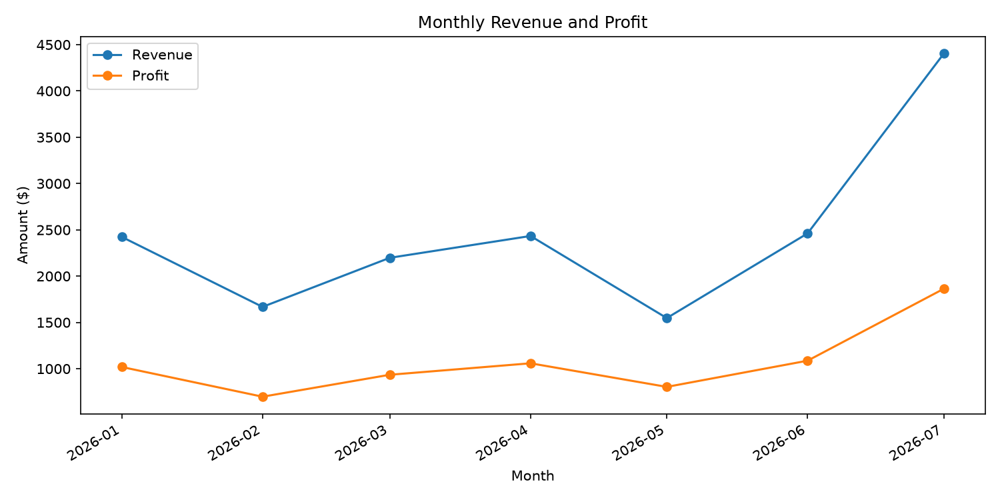
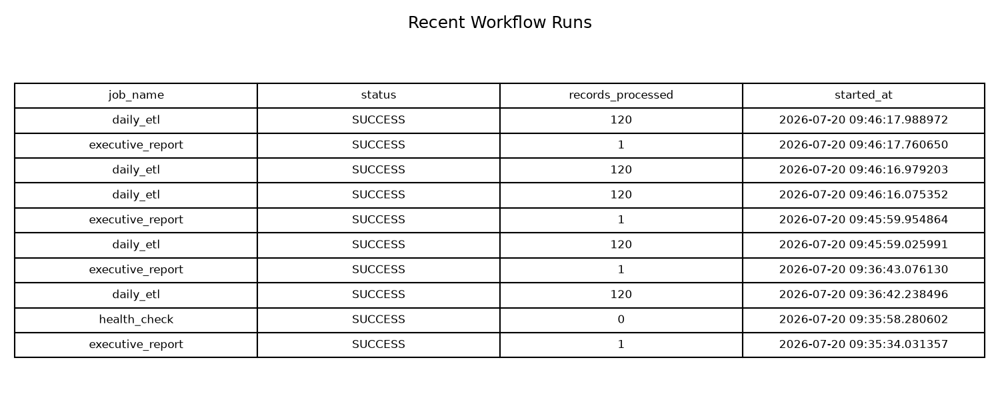

# Enterprise AI Business Intelligence Automation Platform

A production-style, **code-only** enterprise BI platform for retail analytics. It automates daily ETL, KPI reporting, AI executive summaries, workflow monitoring, and dashboard delivery using Python, PostgreSQL, APScheduler, and Streamlit.


## Business Problem

Retail executives need daily answers to:
- How much revenue and profit did we generate?
- How many orders came in?
- Which products are performing best?
- Are we running low on inventory?
- What should management do next?

This project replaces manual reporting with an auditable automated pipeline.

## Highlights

- Modular Python ETL with validation and reject handling
- PostgreSQL layered schema with analytics views
- Scheduled jobs for ETL, reporting, and health checks
- AI summary service with safe KPI JSON input and template fallback
- Seven-page Streamlit executive dashboard
- Docker Compose deployment
- Unit, integration, and CI test coverage

## Architecture



See [docs/ARCHITECTURE.md](docs/ARCHITECTURE.md) and [docs/ER_DIAGRAM.md](docs/ER_DIAGRAM.md) for full diagrams.

## Tech Stack

| Layer | Technology |
|-------|------------|
| Language | Python 3.11+ |
| Database | PostgreSQL 16 |
| ORM / SQL | SQLAlchemy |
| Analytics | pandas + SQL views |
| Scheduling | APScheduler |
| AI | OpenAI API (optional) |
| Dashboard | Streamlit |
| Containers | Docker Compose |
| CI | GitHub Actions |

## Quick Start

### 1. Install dependencies

```powershell
cd enterprise-bi-platform
python -m venv venv
.\venv\Scripts\Activate.ps1
pip install -r requirements.txt
copy .env.example .env
```

### 2. Start PostgreSQL

```powershell
cd docker
docker compose up -d postgres
cd ..
```

PostgreSQL runs on **port 5433** by default.

### 3. Run the pipeline

```powershell
python -m src.run_pipeline
```

### 4. Launch the dashboard

```powershell
streamlit run dashboards/app.py
```

Open http://localhost:8501

### 5. Generate README screenshots

```powershell
python scripts/generate_screenshots.py
```

## Screenshots

| Executive KPIs | Top Products |
|---|---|
|  |  |

| Monthly Revenue | Workflow Monitoring |
|---|---|
|  |  |

## Project Structure

```text
enterprise-bi-platform/
├── src/                 # Application code
├── dashboards/          # Streamlit UI
├── database/            # Schema and seed data
├── tests/               # Unit and integration tests
├── docs/                # Architecture, interview, deployment guides
├── scripts/             # Utility scripts
├── docker/              # Docker Compose services
└── .github/workflows/   # CI pipeline
```

## KPI Definitions

| KPI | SQL Definition |
|-----|----------------|
| Revenue | `SUM(total_amount)` |
| Orders | `COUNT(DISTINCT order_id)` |
| Profit | `SUM(profit_amount)` |
| AOV | `Revenue / Orders` |

## Environment Variables

| Variable | Required | Description |
|----------|----------|-------------|
| `DATABASE_URL` | Yes | PostgreSQL connection string |
| `OPENAI_API_KEY` | No | Enables OpenAI summaries |
| `SLACK_WEBHOOK_URL` | No | Enables Slack alerts |
| `SMTP_*` | No | Enables email delivery |

The project works fully without OpenAI or Slack.

## Manual Commands

```powershell
python -m src.jobs.daily_etl
python -m src.jobs.executive_report
python -m src.jobs.health_check
python -m src.run_pipeline
python -m src.scheduler
pytest
```

## Documentation

- [Architecture](docs/ARCHITECTURE.md)
- [ER Diagram](docs/ER_DIAGRAM.md)
- [Workflows](docs/WORKFLOWS.md)
- [Deployment](docs/DEPLOYMENT.md)
- [Interview Guide](docs/INTERVIEW_GUIDE.md)
- [Demo Script](docs/DEMO_SCRIPT.md)
- [Changelog](CHANGELOG.md)

## Resume Bullets

- Developed an enterprise AI-powered Business Intelligence automation platform using Python, PostgreSQL, APScheduler, and Streamlit.
- Built a modular ETL pipeline with validation, reject handling, idempotent loading, and audit logging.
- Designed PostgreSQL analytics views and an executive dashboard for KPI monitoring and business storytelling.
- Implemented workflow monitoring, optional AI-assisted reporting, and stakeholder notification hooks.

## Final Checklist

- [x] GitHub-ready repository structure
- [x] Architecture and ER diagrams
- [x] Workflow documentation
- [x] Sample data and working pipeline
- [x] Dashboard with filters and CSV export
- [x] Tests and CI workflow
- [x] README screenshots
- [ ] Demo video (use [docs/DEMO_SCRIPT.md](docs/DEMO_SCRIPT.md))

## License

MIT — see [LICENSE](LICENSE).
