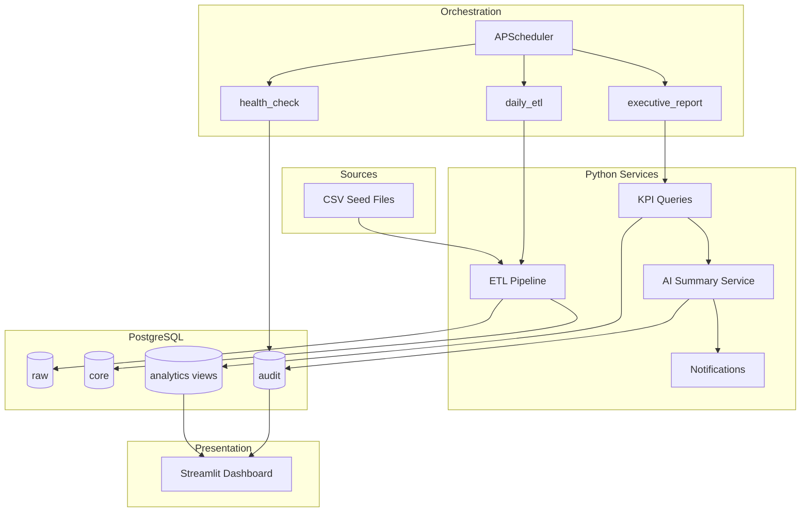

# Architecture

## System Overview

This platform automates the daily retail BI reporting lifecycle using Python, PostgreSQL, and Streamlit.



## Data Flow

```text
1. Extract CSV files (customers, products, inventory, orders)
2. Validate business rules and reject bad rows
3. Transform records and calculate profit
4. Load into core tables using UPSERT
5. Query analytics SQL views for KPIs
6. Generate executive summary from KPI JSON
7. Persist audit logs and optional notifications
8. Render dashboard from SQL views
```

## Layer Responsibilities

| Layer | Responsibility |
|-------|----------------|
| `raw` | Preserve original payloads for auditability |
| `staging` | Temporary validation and rejected records |
| `core` | Normalized business entities |
| `analytics` | KPI views consumed by dashboard and AI |
| `audit` | Workflow runs, AI summaries, alerts |

## Job Schedule

| Job | Schedule | Purpose |
|-----|----------|---------|
| `daily_etl` | Daily 07:00 | Ingest and load data |
| `executive_report` | Daily 07:15 | KPI summary and notifications |
| `health_check` | Every hour | Detect failed workflow runs |

## Design Decisions

- **Code-only orchestration:** Easier to test, version, and explain in interviews than visual workflow tools.
- **KPIs in SQL views:** Keeps analytics logic close to the data warehouse.
- **AI after validation:** The model receives structured KPI JSON, not raw CSV rows.
- **Idempotent UPSERT:** Safe to rerun jobs without duplicating records.
