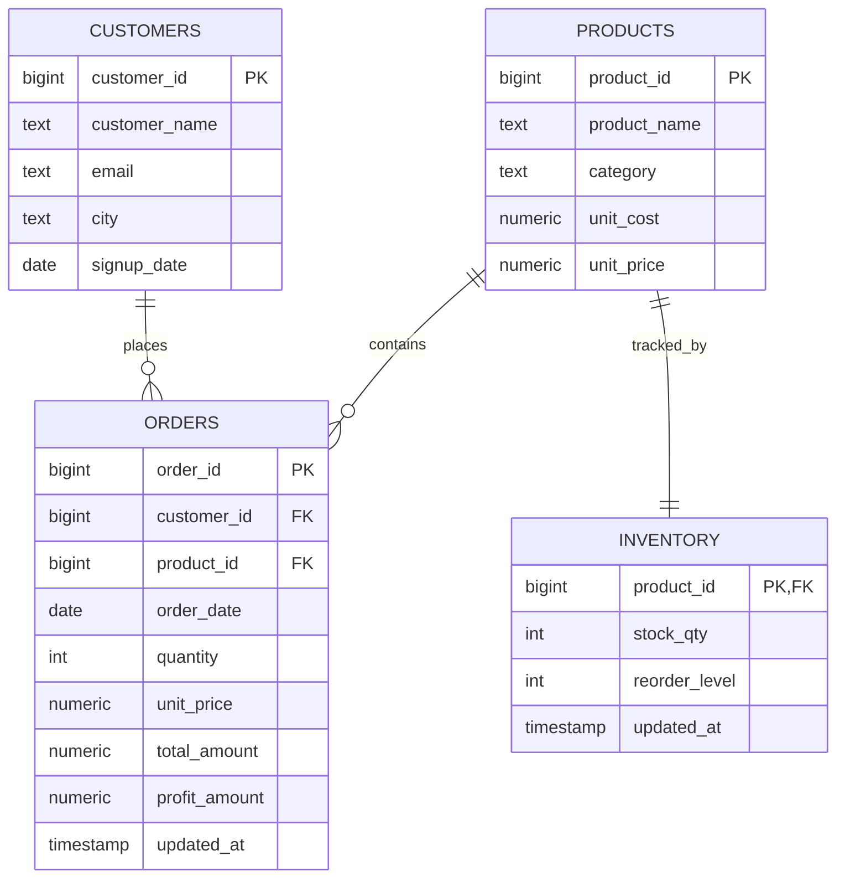
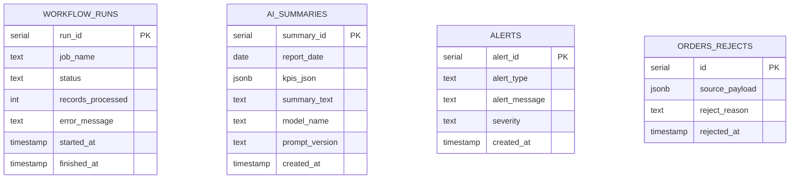

# Entity Relationship Diagram

## Core Business Model



## Audit and Operations Model



## Schema Layers

```text
raw.orders              -- immutable ingest payloads
staging.orders          -- cleaned staging area
staging.orders_rejects  -- invalid records with reasons
core.*                  -- business entities
analytics.v_*           -- KPI and reporting views
audit.*                 -- operational telemetry
```
